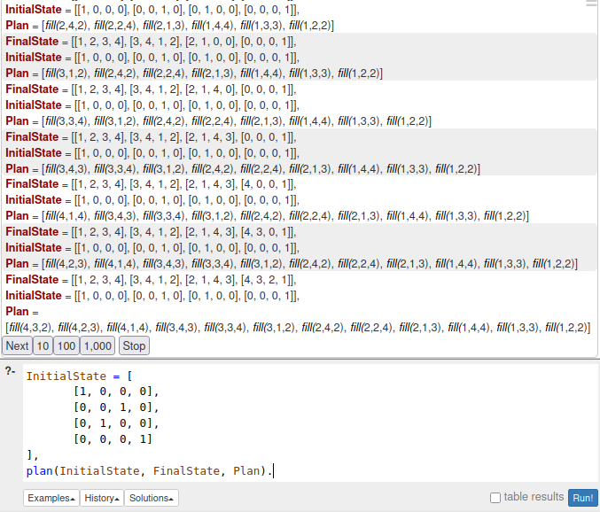

# Atividade sobre planejamento

## Equipe
- **Disciplina**: Inteligência Artificial IEC034/ICC265 - 2025/1  
- **Curso**: Ciência/Engenharia da Computação - Turmas CO01 e CB500  
- **Integrantes**:
  - Jéssica de Figueredo Colares - 22060036
  - Antonio Mileysson França Bragança - 21850963
  - Luís Eduardo Bentes Negreiros - 22251141
  - Lucas Vinícius Gonçalves Gadelha - 22050517
  - Gilmar Eduardo Costa do Couto Júnior - 22152247
## Explicação da atividade 
### 1. Analisar o código abaixo em Prolog  que não está funcionando, e explicar porque não funciona.

```prolog
% Define numbers 1-4
num(1). num(2). num(3). num(4).

% Main planning predicate
plan(InitialState, FinalState, Plan) :-
    % Copy InitialState to work on it
    copy_term(InitialState, CurrentState),
    % Generate the plan by filling empty cells
    plan_step(CurrentState, FinalState, [], Plan).

% Base case: If CurrentState matches FinalState, stop.
plan_step(FinalState, FinalState, Plan, Plan).

% Recursive case: Find an empty cell, fill it, and continue.
plan_step(CurrentState, FinalState, PartialPlan, Plan) :-
    nth1(Row, CurrentState, RowList),
    nth1(Col, RowList, 0),
    num(Num),
    is_valid(CurrentState, Row, Col, Num),
    fill_cell(CurrentState, Row, Col, Num, NewState),
    Action = fill(Row, Col, Num),
    plan_step(NewState, FinalState, [Action | PartialPlan], Plan).

% Check if Num can be placed at (Row, Col) without conflicts
is_valid(State, Row, Col, Num) :-
    nth1(Row, State, RowList),
    \+ member(Num, RowList),
    column(State, Col, ColumnList),
    \+ member(Num, ColumnList),
    subgrid(State, Row, Col, Subgrid),
    \+ member(Num, Subgrid).

% Extract a column from the grid
column([], _, []).
column([Row|Rest], Col, [Value|Values]) :-
    nth1(Col, Row, Value),
    column(Rest, Col, Values).

% Extract the 2x2 subgrid containing (Row, Col)
subgrid(State, Row, Col, Subgrid) :-
    SubRow is ((Row • 1) // 2) * 2 + 1,
    SubCol is ((Col • 1) // 2) * 2 + 1,
    nth1(SubRow, State, Row1),
    nth1(SubRow + 1, State, Row2),
    nth1(SubCol, Row1, A), nth1(SubCol + 1, Row1, B),
    nth1(SubCol, Row2, C), nth1(SubCol + 1, Row2, D),
    Subgrid = [A, B, C, D].

% Fill cell (Row, Col) with Num
fill_cell(State, Row, Col, Num, NewState) :-
    nth1(Row, State, RowList),
    replace(RowList, Col, Num, NewRowList),
    replace(State, Row, NewRowList, NewState).

% Helper: Replace element at position in a list
replace([_|T], 1, X, [X|T]).
replace([H|T], Pos, X, [H|NewT]) :-
    Pos > 1,
    NextPos is Pos • 1,
    replace(T, NextPos, X, NewT).
% #### **Output (One Possible Solution)**

FinalState = [
[1, 3, 4, 2],
[4, 2, 1, 3],
[2, 4, 3, 1],
[3, 1, 2, 4]
],
Plan = [
fill(1, 2, 3), fill(1, 3, 4), fill(1, 4, 2),
fill(2, 1, 4), fill(2, 3, 1), fill(2, 4, 3),
fill(3, 1, 2), fill(3, 2, 4), fill(3, 4, 1),
fill(4, 1, 3), fill(4, 2, 1), fill(4, 3, 2)
].
```
---


O código apresentado é um programa em Prolog que resolve um puzzle Sudoku 4x4, gerando um plano de ações para preencher uma grade inicial vazia (com zeros) até uma solução completa. Para a realização dessa atividade, foi utilizado um chatbot: o **ChatGPT**.

#### **1. Base de Números Permitidos**
```prolog
num(1). num(2). num(3). num(4).
```
Define que os únicos números válidos para preenchimento são 1 a 4.

---

#### **2. Predicado Principal: `plan/3`**
```prolog
plan(InitialState, FinalState, Plan)
```
- Gera um plano (`Plan`) de ações que transforma o estado inicial (`InitialState`) em um estado final (`FinalState`).
- Usa `copy_term` para preservar o estado original e evita efeitos colaterais.

---

#### **3. Predicado Recursivo: `plan_step/4`**
Responsável por preencher célula por célula, de forma **recursiva**:
- **Caso base:** quando o estado atual já é igual ao final.
- **Caso recursivo:** encontra uma célula vazia (`0`), tenta preencher com um número válido (1-4), verifica se não há conflitos (linha, coluna, subgrade), preenche, adiciona a ação no plano, e continua.

---

#### **4. Restrições: `is_valid/4`**
Garante que o número inserido não viole as regras:
- **Linha:** o número não pode se repetir.
- **Coluna:** idem.
- **Subgrade 2x2:** o número não pode se repetir nos blocos 2x2.

---

#### **5. Subgrade 2x2**
```prolog
subgrid(State, Row, Col, Subgrid)
```
Calcula a subgrade de 2x2 a partir da célula atual. Exemplo: se `(Row, Col) = (1, 2)`, a subgrade será a de topo-esquerda.

---

#### **6. Mutação de Estado**
```prolog
fill_cell/5` e `replace/4`
```
Realiza a substituição do valor em uma célula, criando um novo estado.

---

#### **Exemplo de Execução**
```prolog
plan(InitialState, FinalState, Plan).
```
Supondo que o `InitialState` tem algumas células com `0`, o sistema preenche os espaços com valores que obedecem às regras, e retorna:
- `FinalState`: Sudoku resolvido.
- `Plan`: lista de ações `fill(Row, Col, Num)` descrevendo cada preenchimento feito.

---

### 2. Indicar como pode ser alterado para funcionar 

#### **Correções no Código**
Há alguns erros de digitação no código fornecido:

1. Em `subgrid/3`:
```prolog
SubRow is ((Row - 1) // 2) * 2 + 1,
SubCol is ((Col - 1) // 2) * 2 + 1,
```
No código aparece `•` em vez de `-`, o que quebraria a execução.

2. Em `replace/4`, mesma coisa:
```prolog
NextPos is Pos - 1,
```
### 3. Implementar a mudança e mostrar funcionando
Feita as correções, que estão implementadas no código sudoku_with_plan.pl, um possível exemplo que poderia ser testado seria:

```prolog
?- InitialState = [
    [1, 0, 0, 0],
    [0, 0, 1, 0],
    [0, 1, 0, 0],
    [0, 0, 0, 1]
    ],
   plan(InitialState, FinalState, Plan).
```
No nosso caso, a solução encontrada foi:




### 4. Estudar o método Goal regression, e explicar a diferença para means-ends

### 5. Implementar goal regression
